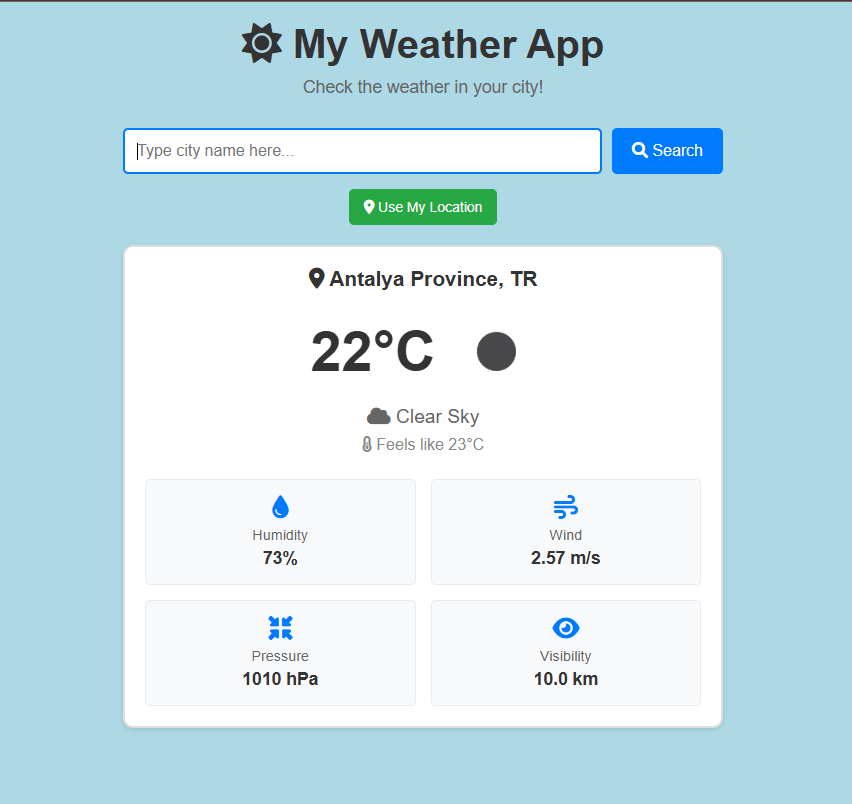

# 🌤️ Weather App

A simple and beginner-friendly weather application built with Vue.js that provides real-time weather information for any city worldwide.

## 📸 Screenshot



## ✨ Features

- 🔍 **City Search**: Enter any city name to get current weather
- 📍 **Location Detection**: Use your current GPS location for local weather
- 🌡️ **Detailed Weather Info**: Temperature, feels-like, humidity, wind speed, pressure, and visibility
- 🎨 **Weather Icons**: Visual weather condition indicators from OpenWeatherMap
- 📱 **Responsive Design**: Works perfectly on desktop and mobile devices
- ⚡ **Real-time Data**: Live weather updates from OpenWeatherMap API
- 🎯 **User-friendly Interface**: Clean, simple design perfect for beginners
- 🔄 **Loading States**: Visual feedback during data fetching
- ❌ **Error Handling**: Clear error messages for invalid cities or network issues

## 🛠️ Built With

- **Vue.js 3** - Progressive JavaScript framework
- **Axios** - HTTP client for API requests  
- **OpenWeatherMap API** - Weather data provider
- **Font Awesome** - Beautiful icons
- **CSS3** - Responsive styling with Grid and Flexbox
- **HTML5 Geolocation API** - Current location detection

## 🚀 Getting Started

### Prerequisites

- Node.js (v14 or higher)
- npm or yarn
- OpenWeatherMap API key (free)

### Installation

1. **Clone the repository**
   ```bash
   git clone https://github.com/yourusername/weather-app.git
   cd weather-app
   ```

2. **Install dependencies**
   ```bash
   npm install
   # or
   yarn install
   ```

3. **Get API Key**
   - Go to [OpenWeatherMap](https://openweathermap.org/api)
   - Sign up for a free account
   - Get your API key from the dashboard

4. **Add API Key**
   - Open `src/components/weatherApp.vue`
   - Replace `'YOUR_API_KEY_HERE'` with your actual API key
   - For production, use environment variables:
   ```bash
   # Create .env file
   VUE_APP_WEATHER_API_KEY=your_api_key_here
   ```

5. **Add Font Awesome** (if not already added)
   - Open `public/index.html`
   - Add this line in the `<head>` section:
   ```html
   <link rel="stylesheet" href="https://cdnjs.cloudflare.com/ajax/libs/font-awesome/6.0.0/css/all.min.css">
   ```

6. **Run the application**
   ```bash
   npm run serve
   # or
   yarn serve
   ```

7. **Open your browser**
   - Navigate to `http://localhost:8080`
   - Start checking the weather! 🌟

## 📁 Project Structure

```
weather-app/
├── public/
│   ├── index.html          # HTML template with Font Awesome
│   └── favicon.ico
├── src/
│   ├── components/
│   │   └── weatherApp.vue  # Main weather component
│   ├── App.vue            # Root component
│   └── main.js            # Vue app entry point
├── package.json
└── README.md
```

## 🎯 How It Works

1. **Search**: User enters a city name or uses current location
2. **API Call**: App sends request to OpenWeatherMap API
3. **Data Processing**: Weather data is processed and displayed
4. **Visual Display**: Shows temperature, weather icon, and details
5. **Error Handling**: Displays helpful messages if something goes wrong

## 🔧 API Endpoints Used

- **Current Weather**: `https://api.openweathermap.org/data/2.5/weather`
- **By City**: `?q={city}&appid={API_key}`  
- **By Coordinates**: `?lat={lat}&lon={lon}&appid={API_key}`


## 📝 License

This project is open source and available under the [MIT License](LICENSE).

## 🙏 Acknowledgments

- [OpenWeatherMap](https://openweathermap.org/) for the weather API
- [Font Awesome](https://fontawesome.com/) for the beautiful icons
- [Vue.js](https://vuejs.org/) community for the amazing framework

## 📞 Contact

Feel free to reach out if you have any questions or suggestions!

---

**Happy coding! 🌈✨**